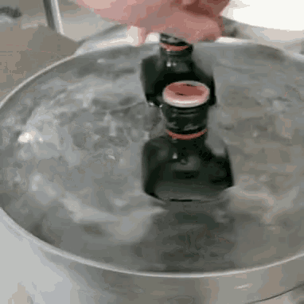

  

  

---

<h1>👋 ¿Qué onda? Soy Tobias </h1>

## 🚀 Sobre mí

- 🇦🇷 Argentina
- 💻 Fullstack en construcción → **C++ | Java | PHP | HTML/CSS | SQL (básico)**
- 🎉 Me gusta salir de fiesta, tomar Jägermeister y hablar de River Plate
- 🎮 Gamer, dev, futbolero y tuitero en mis ratos libres
- 🧠 Siempre mejorando mis habilidades, aplicando lo que aprendo en proyectos reales y sumando experiencia

---

## 🔥 Proyectos en los que estoy

- 🛒 **E-commerce temático Dungeons & Dragons** (CodeIgniter + PHP + Bootstrap)
- 🏥 **HospiTrack** - Sistema de gestión hospitalaria (Proyecto integrador universitario)
- 💡 Ideas random que salen de la nada pero me divierten

---

## 🛠️ Tecnologías que manejo

---

  

  

<b>❤️🐔 Codeo, festejo goles y salgo de fiesta. Eso es todo lo que tenés que saber.</b>

<!---
33Tobias/Perfil es un repo especial porque su README.md se muestra en tu perfil.
--->

