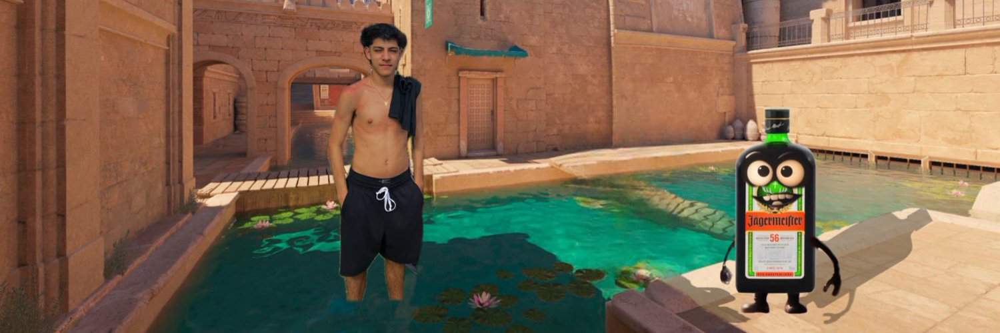

  

  

---

<table align="center" cellspacing="0" cellpadding="0" style="border: 2px solid #3fcf8e; border-radius: 12px; padding: 12px; background-color: #1e1e1e; box-shadow: 0 0 10px rgba(63, 207, 142, 0.5);">
  <tr>
    <td>
      
    </td>
    <td>
      <h1 style="margin: 10px; padding: 10px; color: white;">What's up I'm Tobias</h1>
    </td>
  </tr>
</table>

##  About Me

- 🇦🇷 From Argentina
-  **Bachelor's student in Information Systems** @ **UNNE - Universidad Nacional del Nordeste**
-  Currently in **3rd year**, always learning and improving
-  Fullstack Developer in progress
-  I love partying, drinking Jägermeister and talking about River Plate
-  Gamer, dev, football fan and occasional Twitter addict
-  Growing through real-life projects and hands-on experience

  <a href="https://tobiager.github.io/UNNE-LSI/estado.html#eyJwbGFuIjoiMjAwOSIsInN0YXRlcyI6eyJhbGdvcml0bW9zLWVzdHJ1Y3R1cmFzLWkiOnsicyI6MiwibiI6IlByb21vY2lvbmFkYSBjb24gOSJ9LCJhbGdlYnJhIjp7InMiOjIsIm4iOiJGaW5hbCBjb24gNiJ9LCJhbGdvcml0bW9zLWVzdHJ1Y3R1cmFzLWlpIjp7InMiOjIsIm4iOiJQcm9tb2Npb25hZGEgY29uIDgifSwibG9naWNhLW1hdGVtYXRpY2EtY29tcHV0YWNpb25hbCI6eyJzIjoyLCJuIjoiRmluYWwgY29uIDkifSwic2lzdGVtYXMteS1vcmdhbml6YWNpb25lcyI6eyJzIjoyLCJuIjoiUHJvbW9jaW9uYWRhIGNvbiA3In0sInBhcmFkaWdtYXMteS1sZW5ndWFqZXMiOnsicyI6MiwibiI6IkZpbmFsIGNvbiA2In0sImFycXVpdGVjdHVyYS15LW9yZ2FuaXphY2lvbi1kZS1jb21wdXRhZG9yYXMiOnsicyI6MiwibiI6IlByb21vY2lvbmFkYSBjb24gOSJ9LCJjYWxjdWxvLWRpZmVyZW5jaWFsLWUtaW50ZWdyYWwiOnsicyI6MSwibiI6IiJ9LCJwb28iOnsicyI6MiwibiI6IkZpbmFsIGNvbiA3In0sInNpc3RlbWFzLW9wZXJhdGl2b3MiOnsicyI6MiwibiI6IkZpbmFsIGNvbiA3In0sImFkbWluaXN0cmFjaW9uLXktZ2VzdGlvbi1kZS1vcmdhbml6YWNpb25lcyI6eyJzIjoxLCJuIjoiIn0sImNvbXVuaWNhY2lvbmVzLWRlLWRhdG9zIjp7InMiOjIsIm4iOiJQcm9tb2Npb25hZGEgY29uIDkifSwiaW5nZW5pZXJpYS1kZS1zb2Z0d2FyZS1pIjp7InMiOjEsIm4iOiIifSwidGFsbGVyLWRlLXByb2dyYW1hY2lvbi1pIjp7InMiOjIsIm4iOiJQcm9tb2Npb25hZGEgY29uIDkifSwidGFsbGVyLWRlLXByb2dyYW1hY2lvbi1paSI6eyJzIjozLCJuIjoiIn0sInByb2JhYmlsaWRhZC15LWVzdGFkaXN0aWNhIjp7InMiOjMsIm4iOiIifSwiaW5nbGVzLXRlY25pY28taW5mb3JtYXRpY28iOnsicyI6MywibiI6IiJ9LCJiYXNlLWRlLWRhdG9zLWkiOnsicyI6MywibiI6IiJ9fSwibmFtZSI6IlRvYmlhcyBPcmJhbiJ9">
    
  </a>

---

##  Projects I'm working on

- [**Rama Automotores**](https://v0-rama-automotores-website.vercel.app/) – Buy & sell cars platform 
- [**Erdus**](https://erdus-inky.vercel.app//) – Universal ER diagram converter 
- Random ideas that I enjoy bringing to life

---

##  Technologies I use

---

##  GitHub Stats

  
  

  

##  GitHub Streak

  

---

###  Featured Repositories

  

  

  
<b> Top Contributed Repo</b>

  

    
  

---

##  GitHub Contribution Snake

  <picture>
    <source media="(prefers-color-scheme: dark)" srcset="https://raw.githubusercontent.com/tobiager/tobiager/output/github-snake-dark.svg" />
    <source media="(prefers-color-scheme: light)" srcset="https://raw.githubusercontent.com/tobiager/tobiager/output/github-snake.svg" />
    
  </picture>

---

  

<b>🎮❤️⚽️ I code, score goals and party. That’s all you need to know. </b>

  

<b>Made it to the end? You earned a shot! 🥂</b>

