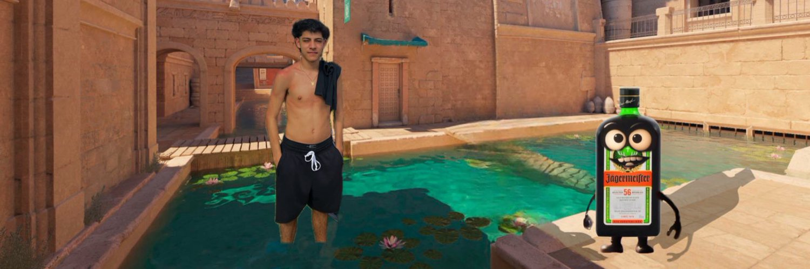

    
  </a>

  

---

<table align="center" cellspacing="0" cellpadding="0" style="border: 2px solid #3fcf8e; border-radius: 12px; padding: 12px; background-color: #1e1e1e; box-shadow: 0 0 10px rgba(63, 207, 142, 0.5);">
  <tr>
    <td>
        
      </a>
    </td>
    <td>
      <h1 style="margin: 10px; padding: 10px; color: white;">What's up I'm Tobias</h1>
    </td>
  </tr>
</table>

##  About Me

- 🇦🇷 From Argentina
-  **Bachelor's student in Information Systems** @ **UNNE - Universidad Nacional del Nordeste**
-  Currently in **4th year**, always learning and improving
-  Fullstack Developer in progress

  <a href="https://unne-lsi-web.vercel.app/estado/#eyJwbGFuIjoiMjAwOSIsIm5hbWUiOiJUb2JpYXMgT3JiYW4iLCJzdGF0ZXMiOnsiYWxnb3JpdG1vcy1lc3RydWN0dXJhcy1pIjp7InMiOjIsIm4iOiJQcm9tb2Npb25hZGEgY29uIDkifSwiYWxnZWJyYSI6eyJzIjoyLCJuIjoiRmluYWwgY29uIDYifSwiYWxnb3JpdG1vcy1lc3RydWN0dXJhcy1paSI6eyJzIjoyLCJuIjoiUHJvbW9jaW9uYWRhIGNvbiA4In0sImxvZ2ljYS1tYXRlbWF0aWNhLWNvbXB1dGFjaW9uYWwiOnsicyI6MiwibiI6IkZpbmFsIGNvbiA5In0sInNpc3RlbWFzLXktb3JnYW5pemFjaW9uZXMiOnsicyI6MiwibiI6IlByb21vY2lvbmFkYSBjb24gNyJ9LCJwYXJhZGlnbWFzLXktbGVuZ3VhamVzIjp7InMiOjIsIm4iOiJGaW5hbCBjb24gNiJ9LCJhcnF1aXRlY3R1cmEteS1vcmdhbml6YWNpb24tZGUtY29tcHV0YWRvcmFzIjp7InMiOjIsIm4iOiJQcm9tb2Npb25hZGEgY29uIDkifSwiY2FsY3Vsby1kaWZlcmVuY2lhbC1lLWludGVncmFsIjp7InMiOjEsIm4iOiIifSwicG9vIjp7InMiOjIsIm4iOiJGaW5hbCBjb24gNyJ9LCJzaXN0ZW1hcy1vcGVyYXRpdm9zIjp7InMiOjIsIm4iOiJGaW5hbCBjb24gNyJ9LCJhZG1pbmlzdHJhY2lvbi15LWdlc3Rpb24tZGUtb3JnYW5pemFjaW9uZXMiOnsicyI6MiwibiI6IkZpbmFsIGNvbiA4In0sImNvbXVuaWNhY2lvbmVzLWRlLWRhdG9zIjp7InMiOjIsIm4iOiJQcm9tb2Npb25hZGEgY29uIDkifSwiaW5nZW5pZXJpYS1kZS1zb2Z0d2FyZS1pIjp7InMiOjEsIm4iOiIifSwidGFsbGVyLWRlLXByb2dyYW1hY2lvbi1pIjp7InMiOjIsIm4iOiJQcm9tb2Npb25hZGEgY29uIDkifSwiYmFzZS1kZS1kYXRvcy1pIjp7InMiOjEsIm4iOiJQcm9tb2Npb25hZGEgY29uIDgifSwicHJvYmFiaWxpZGFkLXktZXN0YWRpc3RpY2EiOnsicyI6MCwibiI6IiJ9LCJ0YWxsZXItZGUtcHJvZ3JhbWFjaW9uLWlpIjp7InMiOjEsIm4iOiJQcm9tb2Npb25hZGEgY29uIDEwIn0sImluZ2xlcy10ZWNuaWNvLWluZm9ybWF0aWNvIjp7InMiOjAsIm4iOiIifSwiaW5nZW5pZXJpYS1kZS1zb2Z0d2FyZS1paSI6eyJzIjozLCJuIjoiIn0sImVjb25vbWlhLWFwbGljYWRhIjp7InMiOjEsIm4iOiJQcm9tb2Npb25hZGEgY29uIDgifX19">
    
  </a>

---

##  Technologies I use

---

##  GitHub Stats

</a>
</a>

##  GitHub Streak

<!-- comentario

  

-->

    

---

###  Featured Repositories

  

  

---

##  GitHub Contribution Snake

  <picture>
    <source media="(prefers-color-scheme: dark)" srcset="https://raw.githubusercontent.com/tobiager/tobiager/output/github-snake-dark.svg" />
    <source media="(prefers-color-scheme: light)" srcset="https://raw.githubusercontent.com/tobiager/tobiager/output/github-snake.svg" />
    
  </picture>

---

  

<b>🎮❤️⚽️ I code, score goals and party. That’s all you need to know. </b>

